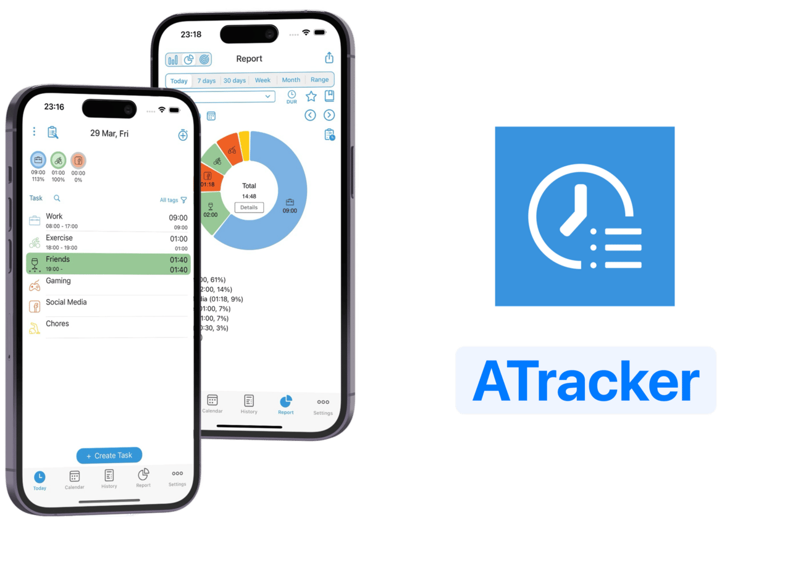
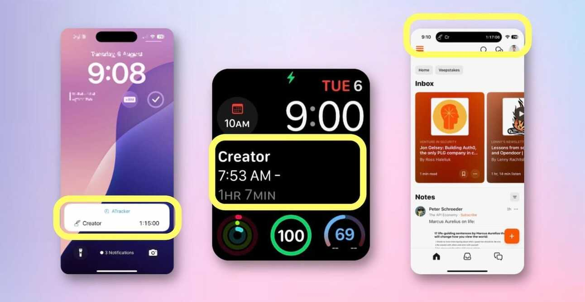
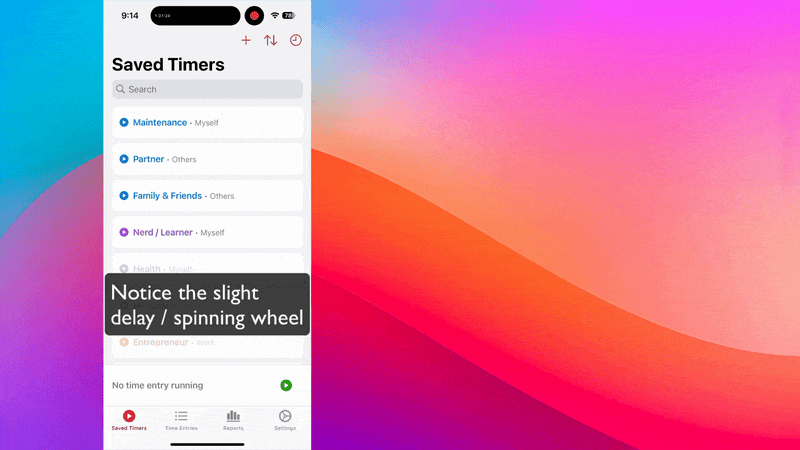
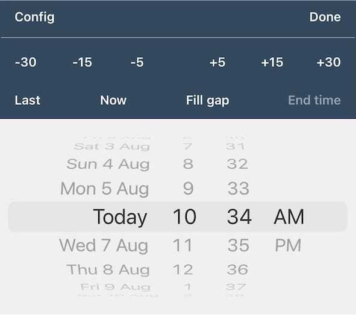
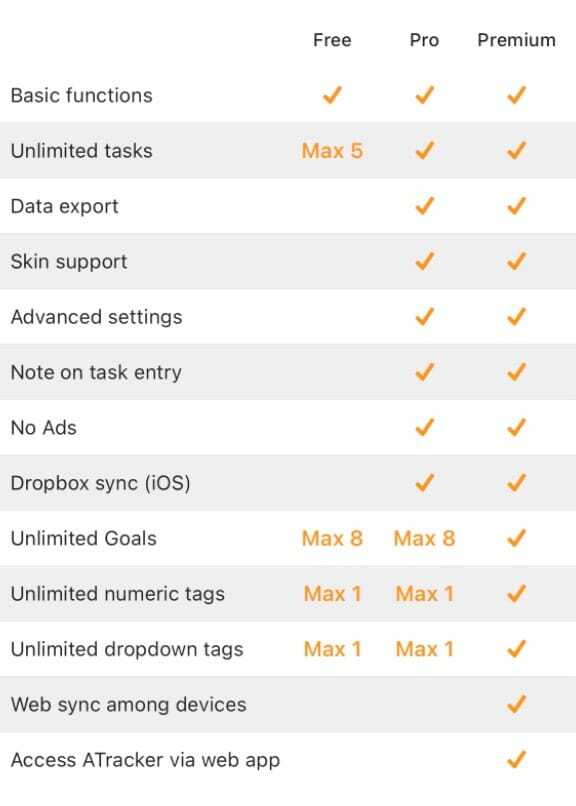
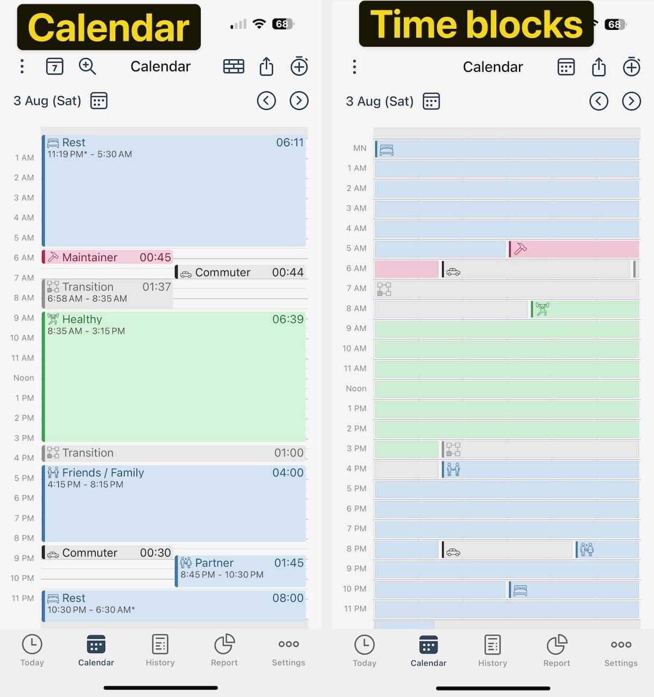
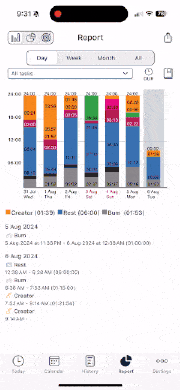
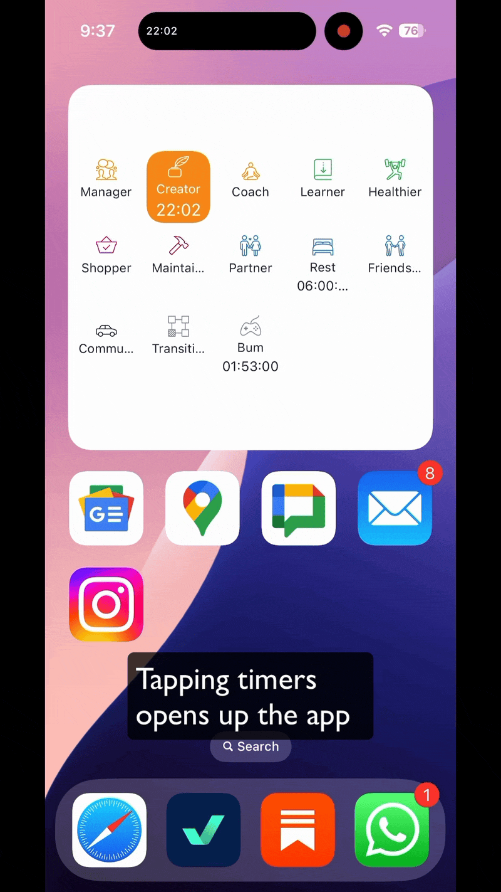
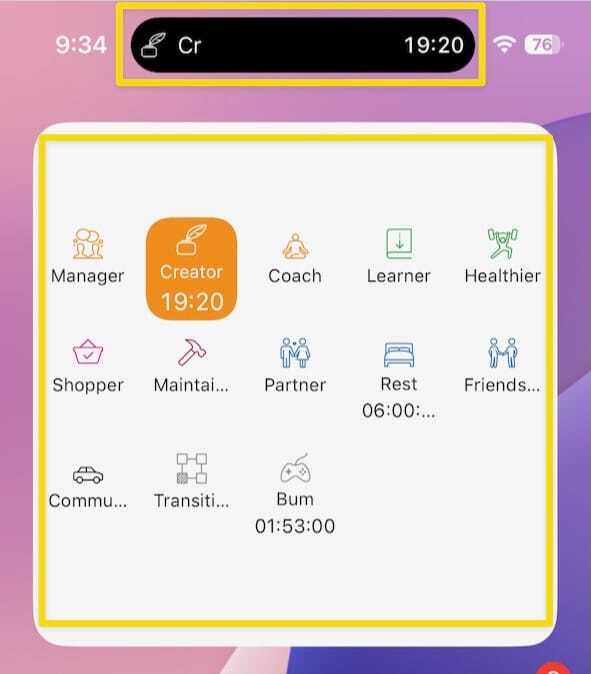
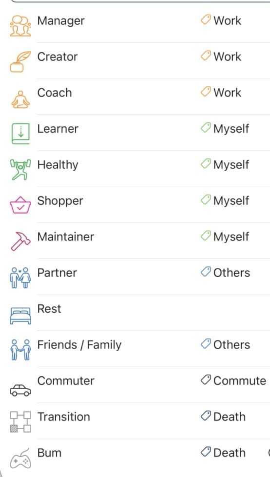

    A good tool improves the way you work. A great tool improves the way you think.
    - Jeff Duntemann

Maybe you’ve heard of time-tracking tools; perhaps you’ve even tried a couple. Today, we’re taking a closer look at the benefits, the challenges, and how anyone can find a system that works for them.

## Why You Should Time Track

A quick Google search reveals dozens of time-tracking solutions on the market. When I started my time-tracking journey, it was difficult to choose between the various features and price points.

Fortunately, understanding your purpose for time-tracking will help narrow down your options.

### Certain Industries Require It

Fields like consulting, legal, and freelancing could not operate without tracked hours. Man-days and billable hours are units of measurable effort, making it a vital part of revenue generation.

These tools are tailored for enterprise use and might not be ideal for personal productivity. However, they can be cost-effective since employers often cover subscription costs.

Look for tools with:

- **Team & Role Management**: Efficiently manage team roles and assignments.
- **Corporate Dashboard**: Get an overview of all time-tracking data in one place.
- **Tool Integration**: Sync with your work calendar and phone call log for seamless tracking.

### Combat Procrastination by Injecting Awareness

I found a [study](https://www.semanticscholar.org/paper/TimeAware%3A-Leveraging-Framing-Effects-to-Enhance-Kim-Jeon/54d59cb6a6c5d52184b92363cf3fcfaca2a97d05?ref=de-code.my&utm_source=de-code.beehiiv.com&utm_medium=referral&utm_campaign=an-entrepreneur-s-guide-to-effective-time-tracking) suggesting that users who tracked _unproductive time_ became measurably more productive after eight weeks. Conversely, those who tracked _productive time_ showed no difference whatsoever.

The study also stresses the importance of having an ambient widget displaying time spent procrastinating, which significantly limits total procrastination time.

Each glance at the timer prompts us to ask ourselves, “Is this how I want to spend my time?”

- **Easy Access**: Multi-platform availability, including lock screen and Siri control.
- **Constant Preview**: Widgets or menu bars that keep your data in view.
- **Great UI/UX**: User-friendly interface, often with tactile feedback.

### Strategic Data Insights

We humans are poor at judging the passing of time. In fact, [emotional factors](https://www.semanticscholar.org/paper/Time-Perception-and-Time-Management-during-COVID-19-Makarova-Makarova/f9004ff7869da323f5ece9f4f3d47f53e58574b4?ref=de-code.my&utm_source=de-code.beehiiv.com&utm_medium=referral&utm_campaign=an-entrepreneur-s-guide-to-effective-time-tracking) play a more significant role in the perception of time than relying on our “internal clock.”

Personally, I’m surprised that I spent 25 hours a week commuting, translating to more than three hours of commute a day. Having objective data helps us make more informed decisions, such as deciding to leave the house earlier to avoid traffic or loading an educational podcast to increase the quality of time spent commuting.

Features to consider:

- **Automatic Time-Tracking**: Reduced friction in time logging.
- **CSV Export**: Easily export data for in-depth analysis.
- **Data Visualization**: Clear and insightful visual representations of your time usage.
- **Tagging and Organization**: Better categorization and sorting of tasks.
- **Email Reporting**: Regular updates and reports sent directly to your inbox.

### Avoid The Feeling of Being Stuck in Life

You could spend an entire day working and putting out fires but still feel like you haven’t made any progress. Does this sound familiar?

The evidence is anecdotal, but I strongly believe that it’s because we spend significant time and resources on urgent/important tasks and urgent/non-important tasks.

This leaves many non-urgent/important tasks in the backlog, but these are usually items that reduce your need for fire-fighting in the first place.

Feeling stuck in life represents a discrepancy between our priorities in life and the actual time spent on them, and time-tracking can help us be objective in this regard.

This is where time-tracking comes into play — it provides an objective metric that highlights the discrepancy between perceived priorities and actual commitment to them.

## Why Time Tracking is Difficult

Time tracking is a notoriously hard habit to cultivate. I have personally tried my hand at it several times, jumping between various solutions before I settled on a system that works consistently.

Here are the common roadblocks I’ve encountered:

1\. **It Requires Constant Awareness**

Time tracking shouldn’t be mistaken for time blocking. Time blocking pre-plans for the future, while time tracking governs the present and past. Time blocking is a 20-minute endeavour of populating calendars with blocks of time, assigning each hour to a particular purpose. Time tracking, however, requires consistent awareness and upkeep to maintain.

**Solution**: Having tools of awareness (via widgets) and the ability to quickly switch timers with as few motions and clicks as possible is crucial.

2\. **Intrusiveness Resulting in Inconsistency**

Time tracking is undeniably disruptive to your flow. Imagine being motivated to hit the ground running, only to be hindered by the need to start a timer.

It’s inevitable to forget logging your time throughout the day, and that’s okay. Between the time logging and deep work trade-off, it always pays to favour deep work.

**Solution**: Features that make adjusting and adding time entries convenient.

3\. **Negative Perception**

Time tracking has a bad reputation, and some of my peers were surprised that I attempted this endeavour in the first place. It’s often viewed as micromanagement and becomes an added burden, especially if I’m already under high stress and overloaded with work — even if starting timers takes just two taps.

The same Penn State University study cited above also reveals higher degrees of stress despite the higher degrees of productivity associated with time tracking.

Additionally, there’s a lack of immediate benefits — trend data becomes meaningful months down the road. Overcoming the initial bumps requires persistence, and the absence of immediate rewards can be demotivating.

**Solution**: Being constantly reminded of the purpose of time tracking, especially from others who have successfully cultivated the habit, can be motivating. For me, it’s been motivational hearing from CGPGrey and Mike Hurley on the [Cortex Podcast](https://www.relay.fm/cortex/44?ref=de-code.my&utm_source=de-code.beehiiv.com&utm_medium=referral&utm_campaign=an-entrepreneur-s-guide-to-effective-time-tracking).

## Tools For Time-Tracking

<small>ATracker — De-code’s time tracker of choice</small>

### Editor’s Pick:** **[ATracker](https://atracker.pro/home.html?ref=de-code.my&utm_source=de-code.beehiiv.com&utm_medium=referral&utm_campaign=an-entrepreneur-s-guide-to-effective-time-tracking)

For readers who want a quick TL;DR, I use ATracker, which is available on iOS, watchOS, and Android devices. ATracker is quite an underrated tool in the market, packing many features that I find relevant despite its under-the-radar reputation.

#### No Real Need for Time-Tracking on Laptop Devices

I wear my Apple Watch frequently throughout the day, making timer switching less disruptive than switching in and out of timer applications on my laptop.

#### Always In View

<small>Time tracked is always up-to-date &amp; visible</small>

ATracker has a decent large-sized complication for my Modular Watchface, letting me know the timer name, duration, and start time — the only three pieces of information I need to make an informed decision. It may seem trivial, but other apps overcomplicate their displays with the separation of projects and descriptions and various icons, which is more distracting than helpful.

ATracker also has great “Live Activities” and “Dynamic Island” functionality, which means that my timers are always in view whenever I view notifications and use my phone. It’s a healthy nudge and reminder whenever I browse Reddit on my phone for too long.

#### Its Speed is Unmatched

<small>Comparing TImery/Toggl with ATracker</small>

ATracker uses a local-first-then-sync methodology — this means that switching timers is practically instantaneous. This is different from apps that require internet connectivity (sorry Toggl), which means that I had to wait a few seconds for my new timer to reflect before I could confidently look away from my phone/watch. Because of its reliance on the internet, timer switching is impossible overseas and slow when I’m without Wi-Fi in places without a strong 5G connection.

Because ATracker is local-first, I am also extremely confident that the timer displayed on the widgets, Live Activities, and Dynamic Island are all up to date — in contrast to internet-reliant options where these displays only refresh every 15 minutes to conserve battery life.

<small>ATracker’s Entry Editing Screen</small>

I also like how incredibly easy it is to adjust start and end times using time intervals and the “last,” “Now,” and “fill gap” buttons.

#### I Like Their Monetisation Policies

<small>ATracker Pricing Tiers</small>

There’s no real reason to upgrade to the paid version of ATracker. The free version comes with all the features that make the app great to use.

I paid for the Pro version, which removes ads from the app (the display banner kind, which is less disruptive than the skip-after-five-seconds type), offers unlimited tasks (the free version comes with five, which is sufficient for most people), CSV exports, and the ability to add notes to task entries. The Pro version is a one-time purchase that costs about £5 or $6.

There is a subscription tier that I find unnecessary for my use case. It syncs your time-tracking with other devices (you can bypass it using the built-in Dropbox feature), allows access to your data from the web, and offers unlimited tags and goals. It costs about £25/yr or $30.

#### Other Bells and Whistles

The app comes with a great tagging and goal system, which replaces the “client” and “habits” available in other apps, both of which are trackable within the reports tab.

<small>Comparisons between Calendar and Time Blocks</small>

It is also the only app I’ve found so far that makes full use of the horizontal and vertical rows of my phone screen space — with the vertical axis being the hours and the horizontal axis being the minutes in said hour. A quick glance at the colours on screen is a good way of telling how much time is spent on a given day. This is different from a typical calendar, where a short 15-minute duration is just a tiny slither on screen.

In fact, I find ATracker’s report functionality relatively more robust than other tools I found — you can easily filter reports by duration, date, tasks, tags, and goals. Another cool feature I rarely find elsewhere is the ability to track occurrences in addition to duration captured — which is great for users who want to track, say, how many times they spent reviewing emails a day.

#### Minor Complaints

The homescreen widget is, albeit ugly, functional and straightforward to use. But it could make better use of the dead space, and the design feels somewhat underdeveloped.

I also dislike how clicking on the widget doesn’t change timers immediately and instead opens up the app. It doesn’t even automatically direct you to the “Today” tab if you were on another tab previously.

<small>Live activities are unclear and confusing</small>

Additionally, I feel that the Dynamic Island is too narrow to include the full task name, and it could make do with a coloured icon rather than a white one.

But these are ultimately minor complaints compared to the immense value that the app brings.

## A Note About: Automatic Vs Manual Time-Tracking

Most of the time-tracking apps I’ve come across fall into one of two categories: automatic and manual time-tracking. While they appear deceptively similar, they serve different purposes.

### Automatic Time-Tracking

**Geared Towards Enterprises**: Automatic time-tracking tools are often designed with billing features and have enterprise pricing. The design philosophy also leans more towards accuracy rather than intentionality, which is more relevant for corporations than for personal productivity.

They tend to be more expensive compared to manual tracking tools, even for personal plans. This is expected, considering the time and effort spent designing the app.

**Restricted to Laptop Devices**: Automatic time tracking is generally limited to laptop devices, which can make tracking time outside the device difficult. This makes sense, as automatic trackers rely on capturing window titles and apps opened.

The only exception I found is the Timing app, which allows you to track time on your phone via Apple’s built-in Screen Time functionality. However, time spent shopping, eating, or working out still needs to be entered manually.

- **Reduced Friction**: Automatic time-tracking is designed to reduce the friction of capturing data by automating it entirely. However, this can somewhat defeat a significant purpose of manual time-tracking, which is to externalise intent.
- **Data Privacy**: I personally trust many of the reputable solutions providers to use and store my data responsibly. However, it doesn’t change the fact that automatic time-tracking requires extensive permissions to review running apps and, in some rare instances, capture screenshots and analyse content on screen. This invasive nature can put off many people.

### Why I Prefer Manual Time-Tracking

**24-hour Time Tracking**: Manual time-tracking is more suited for 24-hour tracking as it is built with accessible widgets, Siri support, and other advanced macOS functionality in mind.

A good time-tracking system should always be present, blend into the background, but be accessible and convenient when you want to use it. It should display relevant data quickly and easily whenever needed.

**It Forces You to Review the Data**: With automated time-tracking, I often forgot that the timer is actually running — making it unlikely that I open the app, let alone review the reports. Tools like Rize.io circumvent this by sending daily emails to your inbox or occasionally invasive notifications that take up a quarter of the screen, but this also disrupts the flow of work.

Manual time-tracking makes reviewing time spent a frequent part of my daily routine — and with ATracker, it’s baked into the same screen as my list of timers.

**Granular Control**: Manual time-tracking provides more granular control over how you categorise time. For instance, Rize.io has a pretty good idea of what apps and websites are designated for what purpose — Canva is for design, and Steam is for gaming. But this also forces the user to adopt the app’s philosophy of how to categorise apps. For instance, Google Sheets can be used to both budget a holiday trip or manage company expenses.

Should it be categorised under work or personal? By default, it will categorise under “productivity” or “spreadsheeting,” but these are not the categories you’d like captured. By the time you’ve customised the rules for automation according to your needs, you’ll often find it much easier to just time-track manually.

### How I Structure My Time-Tracking

There are no fixed ways of tracking time, and it ultimately boils down to personal preferences and circumstances.

For freelancers, it makes sense to track only working hours and segregate them based on projects and tasks, making it easier to bill clients. For beginners, it might be as simple as having four timers — personal, work, travel, and rest.

Personally, the way I time-track is inspired by [David Sparks](https://www.macsparky.com/?ref=de-code.my&utm_source=de-code.beehiiv.com&utm_medium=referral&utm_campaign=an-entrepreneur-s-guide-to-effective-time-tracking) from MacSparky and the [Mac Power Users](https://www.relay.fm/mpu?ref=de-code.my&utm_source=de-code.beehiiv.com&utm_medium=referral&utm_campaign=an-entrepreneur-s-guide-to-effective-time-tracking) podcast. He builds his to-do list system around the idea of _arete_, an ancient Greek term describing excellence within purpose and function. In non-fancy terms, it means separating tasks based on roles in life, and I adopted his methodology for time-tracking instead.

<small>My personal time-tracking categories</small>

Each task in ATracker is named after a role I adopt in life — such as being a department manager, creator of this newsletter, or becoming a HealthyGamer coach. I bundle all daily upkeep activities such as eating, bathing, and cleaning the house under maintenance. Transition refers to dead time between two tasks, such as grabbing coffee or a bathroom break. The rest is pretty self-explanatory.

Each task is given a tag (or client), with the key idea being “Who is this for?” Tasks can be for myself, others, work, or Death. I like the idea of assigning procrastination time to Death because it’s a great reminder of our mortality and how we should spend our time focusing on important things.

I then review my tracked time every week and make observations and strategic adjustments from there.

## General Tips

As someone who gave up time-tracking several times, I wish I had known the following facts sooner.

### It Is Not the Absolute Data That Matters — It’s the Trends

I had a grand narrative that I told myself: Look at how productive and busy I am! I essentially work three jobs but still manage to exercise and spend quality time with my partner. I’ve essentially min-maxed my life!

The first week of time tracking showed me that I’ve been living a lie — and I’ve contributed a quarter of my waking moments to death. No doubt it is shameful, discouraging, and very tempting to quit time-tracking there and then. But it’s important to realise that _crafting a narrative on how I spend my time is a moral judgement_.

Like any moral judgement, it has nothing to do with objective data, so it’s best to leave it out of the picture. It’s impossible to eradicate death time entirely, but it is possible to reduce it — and that became my goal. So far, I’ve managed to reduce death time from 25% to 20%, and there’s plenty of room to optimise.

But overall, I’m quite happy to have tracked my time. These are ultimately tools of truth, and truth can be very hard to face. But there is value in confronting them.

### It’s Okay to Hit a Hard Reset

There is no such thing as loyalty to a particular time-tracking tool. Unlike task management apps, which come with a high cost of platform switching, it doesn’t take much effort to set up new categories when migrating time-tracking apps.

Many paid subscriptions come with a trial period that I encourage everyone to try. In fact, it might be harder to switch time-tracking tools after accumulating months’ worth of data.

## Quick Thoughts on Alternate Apps

### [Timery / TogglTrack](https://timeryapp.com/?ref=de-code.my&utm_source=de-code.beehiiv.com&utm_medium=referral&utm_campaign=an-entrepreneur-s-guide-to-effective-time-tracking)

This is by far the industry standard, and it is an app that I would recommend to anyone interested in time-tracking, both veterans and beginners. However, a recent trip to a rural island without internet connections has tainted my perspective on internet-reliant time-tracking.

Having inaccurate timers on widgets and watch complications is a disruptive experience, and my Apple Watch refuses to switch timers without my phone nearby.

### [Timing](https://timingapp.com/?lang=en&ref=de-code.my&utm_source=de-code.beehiiv.com&utm_medium=referral&utm_campaign=an-entrepreneur-s-guide-to-effective-time-tracking)

I believe Timing is a great app that has done well in blending both automatic and manual time-tracking. I especially like how you can establish nested sub-projects and assign a productivity score to each.

My biggest gripe is with its expensive subscription — which shouldn’t be an issue if you are an existing Setapp subscriber. It’s simply not worth it to subscribe to Timing on the official site because it costs just as much on Setapp.

### [Rize.io](https://rize.io/?ref=de-code.my&utm_source=de-code.beehiiv.com&utm_medium=referral&utm_campaign=an-entrepreneur-s-guide-to-effective-time-tracking)

It’s an automatic time-tracking app that I’ve used for the longest time but also interacted with the least. It has nothing to do with the app and more to do with my priorities as a user — but I never bothered reading the daily reports sent to my inbox or reviewing my tracked time …because the tracking is done entirely automatically.

Additionally, the high price point and the lack of an iOS app are what pushed me away from using Rize.io.

### [Timelines](https://timelines.app/?ref=de-code.my&utm_source=de-code.beehiiv.com&utm_medium=referral&utm_campaign=an-entrepreneur-s-guide-to-effective-time-tracking)

Timelines is now CGPGrey’s tool of choice since moving away from Timery/Toggl. I’ve tried it, hated how clunky it is, disliked its subscription model — and found ATracker, which is a better version of Timelines in every way for my use case. Sorry, Grey.

### [Timemator](https://timemator.com/?ref=de-code.my&utm_source=de-code.beehiiv.com&utm_medium=referral&utm_campaign=an-entrepreneur-s-guide-to-effective-time-tracking)

This is by far the closest contender to ATracker that I came across. It’s a good blend of automatic and manual time-tracking, offline tracking, a one-time purchase business model, has watchOS support, and has great accessibility and reporting tools. It does concern me that the macOS version hasn’t seen an update in almost a year, but the iOS version is seeing more frequent updates. It does cost around $50 to obtain both the iOS and macOS versions, and I will be experimenting with it in the months to come once I’ve saved up enough.

## Writer’s Note

Welcome to the first-ever article from De-code! I’ve settled on time-tracking because it’s a topic that I’ve been asked about a lot by peers and friends.

Do comment down below and let me know your thoughts on time-tracking. Here’s a share button if you know someone who would benefit from reading this article.
