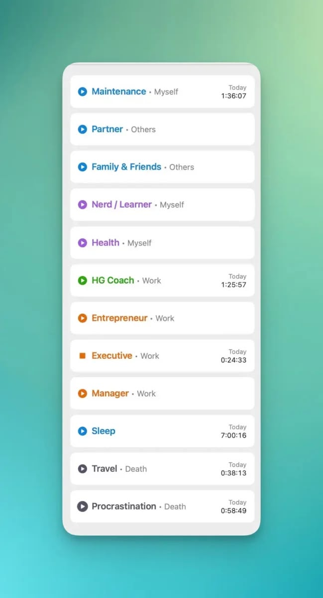

I've started time-tracking 2 weeks ago after being inspired by the Cortex Podcast by Mike and CGP Grey.

Why? Humans are poor judges of how we spend our time. We overestimate the time spent productively while severely underestimating the amount of dead time, or transition time in-between tasks.

Ever since I've finished my postgraduate studies, I've been filling up my hours as best as I can. Despite my best efforts, I always feel like I'm short of time. There are plenty of projects that need completing and new habits to be formed, and yet 24 hours is not enough for my typical day.

Hence, I'd like to test my assumption.

Screenshot of project categories in Timery for Toggle app.

There are a lot of projects that I'm working on:

- Starting a B2B Marketing business.

1. Fulfilling my duties as a HealthyGamer Coach
2. Completing several Mental Health course modules.
3. Signing up for a Cross-fit membership
4. Signing up to join a Dragon Boating team
5. Finishing marathons
6. Meeting with friends or family every week
7. Completing my book reading backlog.
8. Spending quality time with my partner…

But I've chunked them into the following projects, each with one of four "clients" — Work, Myself, Others and Death.

Death is the biggest client that I'm wary of, because in theory, it is time that could be minimised to have a more "efficient" lifestyle.

After a week of logging, here are the results:

- I've managed to get a respectable average of 7 hours of sleep, which is 30 min short of what I'd like it to be.

1. Death makes up the largest time chunk amongst all clients — which is surprising. This shattered any preconception that I was living a productive life.
2. At the beginning, "death" was a single umbrella category, but I have since segregated it into "travel", "procrastination" and "transition". I'm eager to see the time distribution in the upcoming weeks and see how it can be better optimised.
3. I like the time distribution between work, myself, and others, as they represent my priorities and neither is neglected during the week itself.

What have I learnt?

- I may not be as productive as I thought I was, and having data helps provide the objectivity needed to implement better strategies moving forward.

1. An ultra-optimised schedule is an impossibility. A <10% distribution of death alone is an impossible feat, especially for people who need to commute for a living.
2. Hence, it's important to not implement moral judgement on how I spent my time. Was I lazier than expected? Should I be more hardworking? Those are subjective arguments that are indefinite. However, data is objective. This is how I spent my time and it is what it is. It's now up to me to decide what I can do with this information.

I encourage any knowledge worker to take up time-tracking. It is tedious, troublesome and technically challenging, but I do see the benefits of it and will continue this experiment for a while longer.
