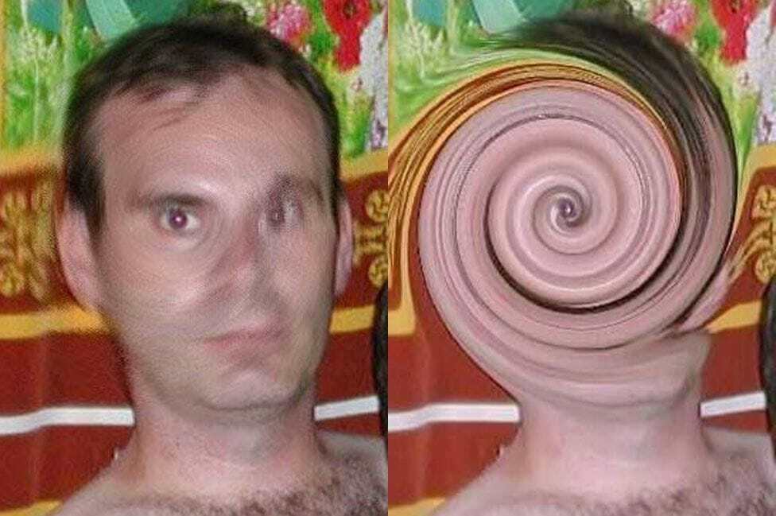
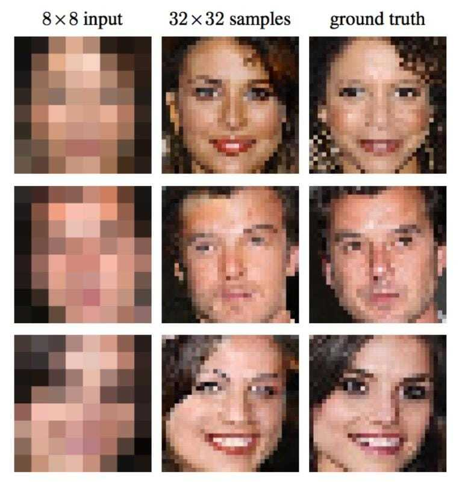
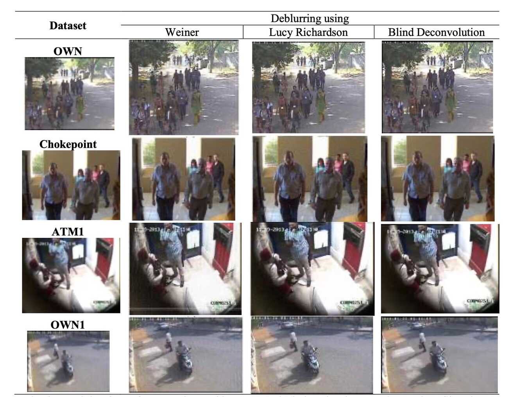
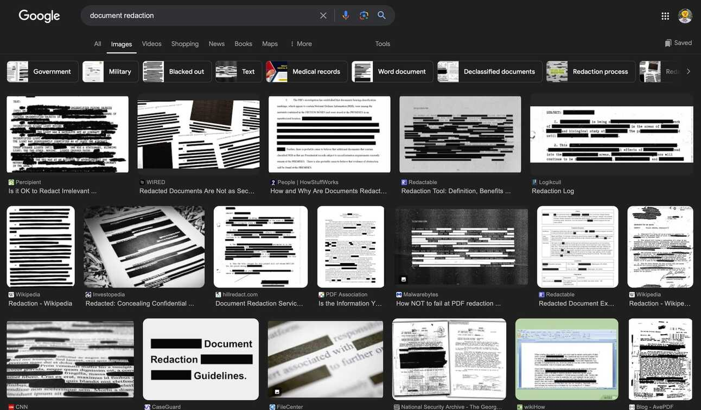
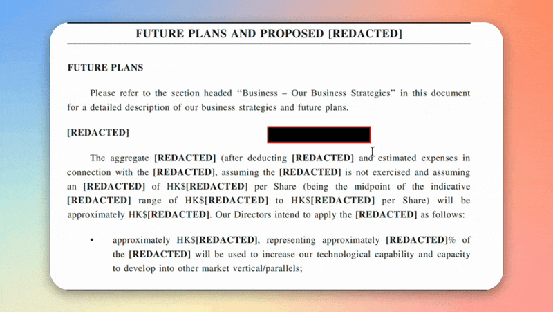
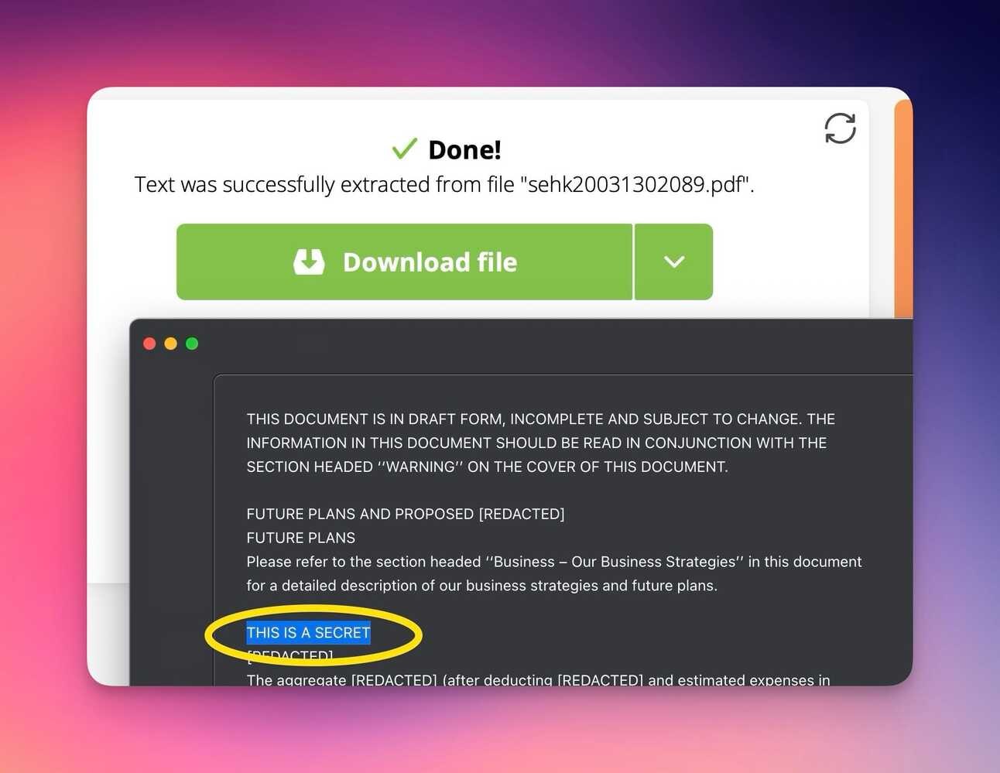
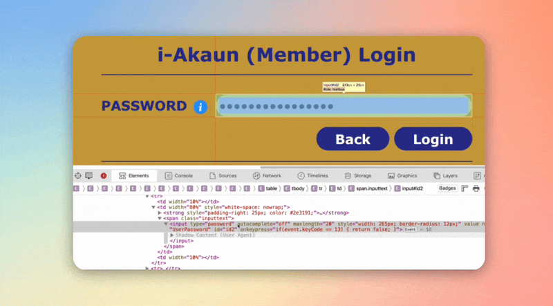
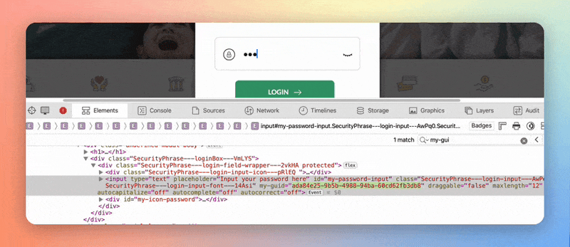
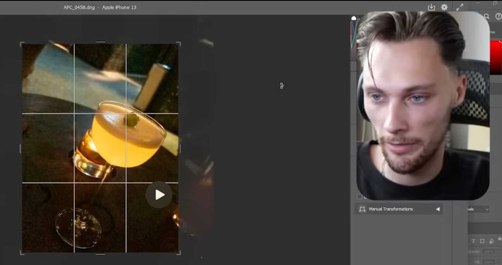
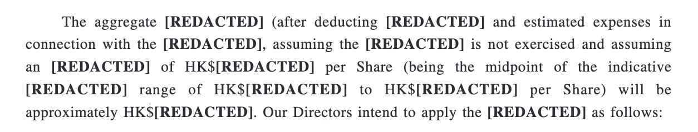

Recovering Redacted Content It’s Scary How Easy It Is

- _**Blurred and pixelated images can often be reverse-engineered**_ _to reveal
  censored details, making them unreliable for secure redaction._
- _**Black bar redaction in digital documents are not foolproof**_ _despite
  being industry standard; hidden text can be retrieved using simple software
  tools._
- _**Proper redaction involves using the right tools**_ _for the job, but can go
  as far as printing, physically cutting out portions, and rescanning in 2-bit._

---

I censor images and documents everyday as part of my job.

It’s nothing overly sensitive like passwords/confidential information; it’s
mainly for communication purposes & document creation — logos, names, or
references that are irrelevant to my recipient.

If it’s irrelevant, it’s a distraction — so I crop, blur, pixelate, and even
compress my images & documents before submission using a combination of
[CleanShot X](https://cleanshot.com/?ref=de-code.my&utm_source=de-code.beehiiv.com&utm_medium=referral&utm_campaign=recovering-redacted-content-it-s-scary-how-easy-it-is)
and
[Clop](https://lowtechguys.com/clop/?ref=de-code.my&utm_source=de-code.beehiiv.com&utm_medium=referral&utm_campaign=recovering-redacted-content-it-s-scary-how-easy-it-is).
So imagine my surprise when I came across a
[YouTube short](https://www.youtube.com/shorts/5LuMEyFEg_E?si=arh8eyTFSxsur6Yq&ref=de-code.my&utm_source=de-code.beehiiv.com&utm_medium=referral&utm_campaign=recovering-redacted-content-it-s-scary-how-easy-it-is)
of Thor explaining that blur is an insecure form of censorship.

<iframe src="https://www.youtube-nocookie.com/embed/5LuMEyFEg_E?rel=0&amp;autoplay=0&amp;showinfo=0&amp;enablejsapi=0" frameborder="0" allow="autoplay; fullscreen" allowfullscreen="true" width="100%" height="409"></iframe>

This sent me down a deep rabbit hole of the (lack of) security — of **not just**
blurred text but also mosaic, pixelation, black bar censorship, as well as photo
cropping.

## Non-destructive Editing — Images and Text

<small>Mr Swirl Face. Source: BBC</small>

I’ll start with the history of
[Christopher Paul Neil](https://en.wikipedia.org/wiki/Christopher_Paul_Neil%20?ref=de-code.my&utm_source=de-code.beehiiv.com&utm_medium=referral&utm_campaign=recovering-redacted-content-it-s-scary-how-easy-it-is),
or Vico, his assigned nickname within the Interpol operation.

- Vico was involved in a high-profile case of child sexual abuse involving at
  least 12 boys in Vietnam, Cambodia, and Thailand.
- He appeared in more than 200 online photographs depicting the abuse, his face
  obscured by a digital swirl.
- However, reversing the censorship simply involves **applying the same swirl
  filter in the opposite direction**, which made his face clearly visible.
- Posting these reconstructed images online led to hundreds of witnesses
  contacting Interpol, which led to his arrest in October 2007.

Hubris is Vico’s downfall — but we are just as likely to make the same mistakes
in our day-to-day censoring efforts.

### Reverse Engineering Text

What surprised me is how accessible these reversal tools are to the wider
public.

For text-blurring reversal, there are two tools that I came across —
[BishopFox’s Unredacter](https://github.com/bishopfox/unredacter?ref=de-code.my&utm_source=de-code.beehiiv.com&utm_medium=referral&utm_campaign=recovering-redacted-content-it-s-scary-how-easy-it-is)
and
[Spipm’s Depix](https://github.com/spipm/depix?ref=de-code.my&utm_source=de-code.beehiiv.com&utm_medium=referral&utm_campaign=recovering-redacted-content-it-s-scary-how-easy-it-is).
Both tools use different algorithms, but the underlying principles remain the
same:

1. Use image cropping tools to isolate the censored text.
2. Obtain and load the font reference materials.
3. The software then conducts multiple experiments — creating blurred versions
   of every alphanumerical character within the reference font
4. These blurred texts are then compared to the censored text, character by
   character.
5. If the generated blurred text looks strikingly similar to the censored text,
   it becomes easy to decipher the original characters.

This solution is straightforward, but not perfect:

- It requires the user to know the font family of the censored text.
  - That’s because the same text in different fonts will produce wildly
    different censored images, which can be hard to reverse-engineer.
  - It shouldn’t be difficult to identify font families using
    [WhatTheFont](https://www.myfonts.com/pages/whatthefont?ref=de-code.my&utm_source=de-code.beehiiv.com&utm_medium=referral&utm_campaign=recovering-redacted-content-it-s-scary-how-easy-it-is),
    or
    [GPT-assisted font identification tools](https://theresanaiforthat.com/font-identification/?ref=de-code.my&utm_source=de-code.beehiiv.com&utm_medium=referral&utm_campaign=recovering-redacted-content-it-s-scary-how-easy-it-is).
- What’s actually hard to decipher is the blur type and intensity, which
  requires trial and error.
- Photoshop alone
  [contains 16 types of blurs](https://www.designiscope.com/post/types-of-blurs-in-photoshop-gaussian-motion-radial-etc?ref=de-code.my&utm_source=de-code.beehiiv.com&utm_medium=referral&utm_campaign=recovering-redacted-content-it-s-scary-how-easy-it-is)
  which can affect the reverse-engineering process.
- Also, the higher the blur intensity — the harder it is to recover the original
  text.

On the flip side, this deciphering method is versatile in theory — allowing
users to recover text that’s blurred, mosaic, or even pixelated.

### Image De-blurring

<small>Face de-pixelation demonstration. Source: Google Brain</small>

Apparently, a
[2017 Google project](https://newatlas.com/google-brain-pixel-recursive-super-resolution/47803/?ref=de-code.my&utm_source=de-code.beehiiv.com&utm_medium=referral&utm_campaign=recovering-redacted-content-it-s-scary-how-easy-it-is)
had already found ways to fill in details of very low-res images. They’re not
exactly accurate, but it’s amazing how much information it can extract with such
limited input. But also imagine how much this technology has advanced, now with
AI advancements and the availability of high-quality training data.

In my research, I’m surprised to see a distinct overlap between reversing image
censorship, image sharpening, and image upscaling.

This makes sense because all these technologies involve analysing surrounding
pixels and using advanced algorithms to make informed decisions on what other
pixel data should be.

I’ve found a
[GitHub repo](https://github.com/subeeshvasu/awesome-deblurring?ref=de-code.my&utm_source=de-code.beehiiv.com&utm_medium=referral&utm_campaign=recovering-redacted-content-it-s-scary-how-easy-it-is)
compiling most of the important research done in this area starting from 2006.
But there are also
[research papers](https://www.semanticscholar.org/paper/Image-Deblurring-Using-Diffraction-Gratings.-Leith/4c03298d4d1de971846cd9828f9b1485d56b01e6?ref=de-code.my&utm_source=de-code.beehiiv.com&utm_medium=referral&utm_campaign=recovering-redacted-content-it-s-scary-how-easy-it-is)
that go as far back as 1980 — using diffraction grating to enhance blurred
images the analogue way, before pixels were even widespread
([it was invented in 1957](https://en.wikipedia.org/wiki/Russell_Kirsch?ref=de-code.my&utm_source=de-code.beehiiv.com&utm_medium=referral&utm_campaign=recovering-redacted-content-it-s-scary-how-easy-it-is)).

But for pixelated images, the technology essentially involves deep learning (DL)
techniques and non-deep learning (non-DL) techniques.

<small>It even works with Video. Source: Github</small>

**DL Characteristics**:

- Produces higher-quality images
- More versatile with various blur types and noise
- Requires significant computational resources for model training
- Models are more complex

**Non-DL Characteristics**:

- Good quality if blur type and intensity are known
- Less versatile than DL methods if data contains varying types of blur
- Computationally and resource efficient
- Algorithm is simple, and thus, more predictable

I can’t find any case studies on image de-blurring being used to reverse
censorship, but it is certainly being used by police authorities.

<small>Different de-blurring algorithms. Source: Journal of Physics</small>

There was
[a case involving CCTV footage of a violent crime in Delhi](https://iopscience.iop.org/article/10.1088/1742-6596/1917/1/012024/pdf?ref=de-code.my&utm_source=de-code.beehiiv.com&utm_medium=referral&utm_campaign=recovering-redacted-content-it-s-scary-how-easy-it-is),
but the footage was so blurred that the perpetrator could not be identified,
despite being directly in front of the camera. De-blurring then played a crucial
role in face detection, which led to better suspect identification. (I wonder if
it’s a more cost effective option than better CCTV investments.)

You can even try out de-blurring for free through Github projects like
[DeepMosaics](https://github.com/hypox64/deepmosaics?ref=de-code.my&utm_source=de-code.beehiiv.com&utm_medium=referral&utm_campaign=recovering-redacted-content-it-s-scary-how-easy-it-is).

## Black Bar Redaction

<small>Google search results for “Document Redaction”</small>

I’d comfortably say that black bar redaction is the industry standard. In fact,
it’s the only thing that comes up while googling the term “redaction”.

Even then, the adage still rings true — if it’s not destructive, it’s likely
reversible. For digital documents, it’s dangerous to assume that just because
the user can’t see it, neither can the computer.

- An example would be **black highlights**, which is different from a proper
  redaction feature. Here’s a
  [Reddit post](https://www.reddit.com/r/wellthatsucks/comments/i1cdpl/the_difference_between_redacting_and_just/?ref=de-code.my&utm_source=de-code.beehiiv.com&utm_medium=referral&utm_campaign=recovering-redacted-content-it-s-scary-how-easy-it-is)
  of a user copying redacted text into a clipboard by simply highlighting the
  redacted areas.

<small>Redacted text being bypassed with a simple highlight + copy &amp; paste.
Source:
<a href="https://www.reddit.com/r/wellthatsucks/comments/i1cdpl/the_difference_between_redacting_and_just/?utm_source=de-code.beehiiv.com&amp;utm_medium=referral&amp;utm_campaign=recovering-redacted-content-it-s-scary-how-easy-it-is" target="_blank">Reddit</a></small>

- This also applies to covering the target text with black boxes. If saved
  improperly, users can simply remove the box layer in Adobe Illustrator or any
  PDF editor.

<small>Removing black boxes by simply moving them using PDF tools</small>

- Sensitive information may also exist within the PDF’s raw data. It could
  easily be extracted simply by converting the PDF into text, or for the more
  technically competent, digging through the source code.

<small>Extracting hidden text by converting PDFs into TXT files</small>

## Obfuscating Passwords Using Asterisks

A quick note regarding asterisk obfuscation: it’s crucial that you complete your
login process and not leave it unattended halfway — don’t assume it’s safe just
because the password is censored.

<small>Revealing password is as simple as editing HTML code in client
browser</small>

I’ve managed to find this flaw in KWSP’s EPF login page — bypassing the
censorship by simply editing a simple HTML line. There are also times when I can
retrieve censored passwords by simply copying them to my clipboard and pasting
them somewhere else

<small>Maybank’s login system is harder to bypass</small>

Fortunately, Maybank’s login page has implemented security measures against this
— implementing some form of encryption and randomly generated UUID upon every
keypress. They even restrict right-clicks on the webpage and any password
manager’s autocomplete system.

I have yet to try it out on the other banking portals just yet.

## Recovering Cropped Screenshots

Another form of censorship is to remove entire sections by simply cropping the
image. This, unfortunately, is not entirely safe either.

<small>Pro geo-guesser discovers more un-cropped image data in RAW file. Source:
RainBolt</small>

As it turns out, you could un-crop JPEG files as well.

The Acropalypse is a vulnerability discovered in 2023, allowing users to view an
un-cropped version of screenshots captured using
[several variants of Google Pixel phones](https://www.androidpolice.com/android-pixel-markup-exploit-discord-acropalypse/?ref=de-code.my&utm_source=de-code.beehiiv.com&utm_medium=referral&utm_campaign=recovering-redacted-content-it-s-scary-how-easy-it-is).

In 2018, the new version of Android (Pie) was released, and the phones received
a new screenshot editor called Markup. It took years for the issue to be brought
up after a user found it strange that a cropped image had an abnormally large
file size, which led to the discovery. A
[patch was released on March 13](https://9to5google.com/2023/03/13/android-13-qpr2-pixel-feature-drop/?ref=de-code.my&utm_source=de-code.beehiiv.com&utm_medium=referral&utm_campaign=recovering-redacted-content-it-s-scary-how-easy-it-is)
to fix them.

You can try un-cropping the affected photos yourself by using the free tools
here:

- [Acropalypse.app](https://acropalypse.app/?ref=de-code.my&utm_source=de-code.beehiiv.com&utm_medium=referral&utm_campaign=recovering-redacted-content-it-s-scary-how-easy-it-is)
- [Acropalypse Multi Tool](https://github.com/frankthetank-music/acropalypse-multi-tool?ref=de-code.my&utm_source=de-code.beehiiv.com&utm_medium=referral&utm_campaign=recovering-redacted-content-it-s-scary-how-easy-it-is)

## The Proper Way of Redaction

Given the vulnerabilities in document redaction, how should we go about properly
redacting documents and images then?

Personally, I think the best resources come from the
[Legal & Defence sectors](https://www.alsd.uscourts.gov/best-practices-redaction-information?ref=de-code.my&utm_source=de-code.beehiiv.com&utm_medium=referral&utm_campaign=recovering-redacted-content-it-s-scary-how-easy-it-is)
because information redaction is integral to their operations.

But here are some key ideas I’ve managed to capture:

<small>Sample of proper redaction techniques</small>

1. **Replace sensitive text with “\[redacted\]”.**

Firstly, replacing the text entirely obfuscates the length of the redacted text,
while you can guesstimate the length of the redacted text using black bars.
Plus, replacing the text entirely is less likely to result in user error, unlike
black boxes which could go either way.

1. **Use Adobe Acrobat’s built-in redaction tool properly.**

Adobe currently dominates the market,
[reportedly holding 76.85% of the share in 2021](https://www.360marketupdates.com/enquiry/request-sample/24002270?ref=de-code.my#utm_source=linkedin007)
— and frankly, it is good enough for the job. Personally, I use
[PDFGear](https://www.pdfgear.com/?ref=de-code.my&utm_source=de-code.beehiiv.com&utm_medium=referral&utm_campaign=recovering-redacted-content-it-s-scary-how-easy-it-is),
as long as you use the appropriate features and tools for redaction.

1. **Utilise image and file compression, size-reducers.**

Not only does this remove hidden metadata that might compromise any redaction
efforts, but it also removes unnecessary bloat that makes sharing files easier.
I personally use
[Clop](https://lowtechguys.com/clop/?ref=de-code.my&utm_source=de-code.beehiiv.com&utm_medium=referral&utm_campaign=recovering-redacted-content-it-s-scary-how-easy-it-is)
for asset compression, but do note that it does not remove all metadata from the
files.

1. **Make the extra effort for truly sensitive data.**

This involves printing out the PDF, physically cutting out sensitive portions,
and re-scanning the document in 2-bit colour format (pure black & white).
Apparently, a US court says that
[this method is 100% effective](https://www.alsd.uscourts.gov/best-practices-redaction-information?ref=de-code.my&utm_source=de-code.beehiiv.com&utm_medium=referral&utm_campaign=recovering-redacted-content-it-s-scary-how-easy-it-is),
despite the disclaimer that they do not explicitly support any specific
redaction methods.

1. **Password protect files/links.**

Passwords help ensure that your redacted documents end up with the right person.
To take one step further, make varied passwords for the different recipients, so
that if a document were to be compromised, there is a chance that it can be
traced back to a particular leaker.

1. **Develop a system to manage unredacted original files.**

All your redaction efforts would be wasted if bad actors got a hold of the
source files, or god forbid, you sharing them publicly by mistake. There are
ways around this, such as having proper file naming structures or having
encrypted hard drives — but these are materials for future articles.

## Writer’s Note

- With that, thanks for reading my second article from De-Code!
- So far I’ve just been writing tech explanations, but do expect some variation
  in content as I’ve just secured a few interviews with subject-matter experts
  next week.
- For now, I’m aiming to adhere to a weekly publishing schedule. I will also
  loop in a colleague of mine in the near future.
